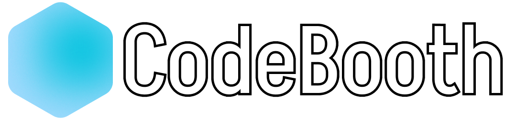

<hr/>
A social media platform that provides a space for developers to connect with each other, share their ideas and knowledge, and collaborate on projects. They can post code snippets, ask for feedback on their projects, and share tips and tricks on programming techniques. The platform would also include a discussion forum where developers can engage in technical discussions and ask questions related to programming. Additionally, it would offer a robust search function that makes it easy for developers to find relevant information and resources.

## Technologies Used
We used the following technologies to build this project:

* MongoDB + Mongoose
* React
* Node.js
* Express
* Tailwind
* Docker

## Installation & Usage
You need to have Docker installed on your machine to run this application. If you don't have Docker installed, you can download it [here](https://www.docker.com/products/docker-desktop).
* Clone the repository.
* Run ```docker-compose up``` to start the application.
* Navigate to ```localhost:4173``` to view the application.

## Creators
* [Saqib Ali](https://github.com/SaqibAMA)
* [Sajawal Ali](https://github.com/Sajawal007)


